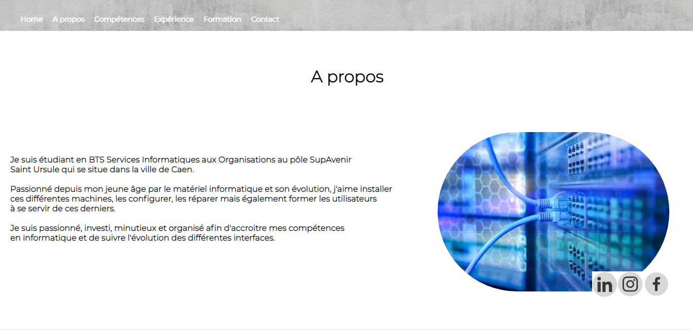
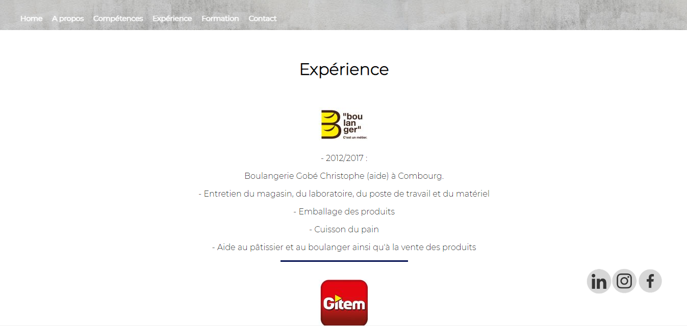

# Bienvenue sur mon Site
**Objectif** : Ce site a pour but de vous présenter mon parcour professionnel et scolaire, il expose mes compétences mais aussi mes différentes formations.
Il vous permettra également de me contacter via le formulaire de contact, ou même via les différents réseaux sociaux.

**Langages utilisés** : HTML, PHP, CSS, JS

**À venir**: Au fur et à mesure de mon parcour je compléterais ce site.

**Lien de déploiement Heroku**:  https://alexandre-gobe.herokuapp.com/

Voici différents points de vue du site:

Réalisé par Gobé Alexandre dans le cadre d'un projet de 1 BTS SIO en 2020 au pôle SupAvenir sainte-Ursule de Caen.
